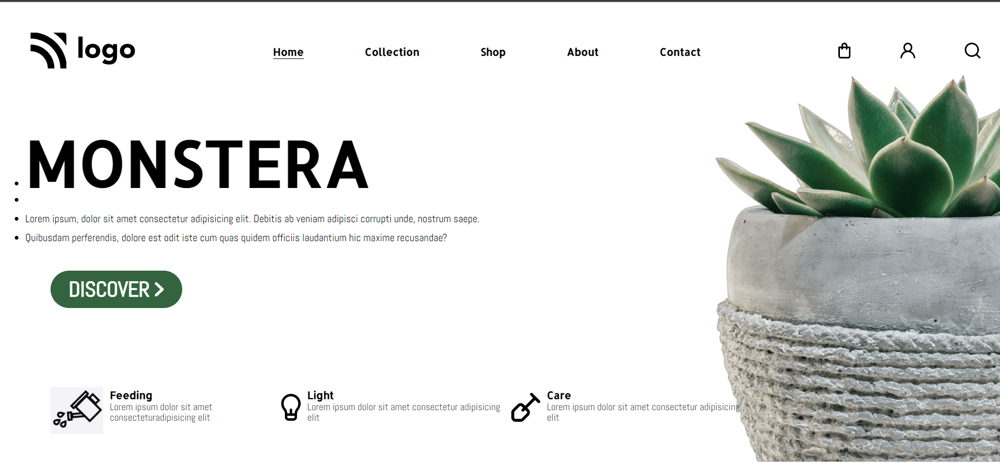

# Assignment 1

## Project 6 [Live Link](https://monstera-landing-page.netlify.app/)

-   Skills Gained in this project
    -   Learned positioning elements
    -   Learned to use pseudo classes like **:nth-child()**, **:not()**, **:last-child**, **first-child**

---

## Time taken to finish this project

-   1 hour to complete it.

#### Screenshot

